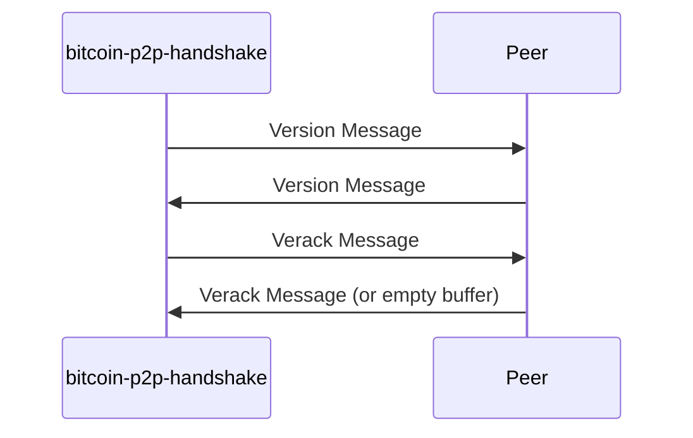

# Bitcoin P2P Handshake

This repo contains a proof-of-concept Rust implementation for the Bitcoin P2P Handshake.

## Performing the Handshake

To perform the handshake, run the following command with a Bitcoin DNS Seed that you want to use:

```rust
cargo run -- [OPTIONS] <DNS SEED> 
```

The program will end by printing the number of successful handshakes performed and the number of unsuccessful handshakes performed.

### Optional Flags:

```
Usage: bitcoin-p2p-handshake [OPTIONS] <DNS_SEED>

Arguments:
  <DNS_SEED>  Bitcoin DNS Seed that is queried

Options:
  -c, --chain <CHAIN>
          The Bitcoin Network to connect to [default: mainnet]
  -p, --port <PORT>
          Port Number of the Receiving Node [default: 8333]
  -s, --services <SERVICES>
          Services supported by the transmitting node encoded as a 64-bit bitfield [default: 0]
  -r, --receiving-services <RECEIVING_SERVICES>
          Services supported by the receiving node encoded as a 64-bit bitfield [default: 0]
  -t, --timeout <TIMEOUT>
          Maximum duration (in seconds) to perform the handshake in [default: 10]
  -h, --help
          Print help
  -V, --version
          Print version

```

### Example:

```rust
cargo run -- --timeout 20 seed.bitcoin.sipa.be

2024-03-13T20:21:29.876522Z  INFO bitcoin_p2p_handshake: src/bin/main.rs:86: Handshake succeeded!
2024-03-13T20:21:30.014362Z  INFO bitcoin_p2p_handshake: src/bin/main.rs:90: Handshake failed with error: command name unknown
2024-03-13T20:21:30.204543Z  INFO bitcoin_p2p_handshake: src/bin/main.rs:90: Handshake failed with error: failed to fill whole buffer
2024-03-13T20:21:30.206861Z  INFO bitcoin_p2p_handshake: src/bin/main.rs:86: Handshake succeeded!
2024-03-13T20:21:30.279773Z  INFO bitcoin_p2p_handshake: src/bin/main.rs:164: VERACK message was not exchanged by peer
2024-03-13T20:21:30.279990Z  INFO bitcoin_p2p_handshake: src/bin/main.rs:86: Handshake succeeded!
2024-03-13T20:21:30.295584Z  INFO bitcoin_p2p_handshake: src/bin/main.rs:164: VERACK message was not exchanged by peer
2024-03-13T20:21:30.295704Z  INFO bitcoin_p2p_handshake: src/bin/main.rs:86: Handshake succeeded!
2024-03-13T20:21:30.376459Z  INFO bitcoin_p2p_handshake: src/bin/main.rs:164: VERACK message was not exchanged by peer
2024-03-13T20:21:30.376632Z  INFO bitcoin_p2p_handshake: src/bin/main.rs:86: Handshake succeeded!
2024-03-13T20:21:30.380465Z  INFO bitcoin_p2p_handshake: src/bin/main.rs:90: Handshake failed with error: command name unknown
2024-03-13T20:21:30.389621Z  INFO bitcoin_p2p_handshake: src/bin/main.rs:90: Handshake failed with error: failed to fill whole buffer
2024-03-13T20:21:30.397715Z  INFO bitcoin_p2p_handshake: src/bin/main.rs:164: VERACK message was not exchanged by peer
2024-03-13T20:21:30.397813Z  INFO bitcoin_p2p_handshake: src/bin/main.rs:86: Handshake succeeded!
2024-03-13T20:21:30.403588Z  INFO bitcoin_p2p_handshake: src/bin/main.rs:90: Handshake failed with error: command name unknown
2024-03-13T20:21:30.403652Z  INFO bitcoin_p2p_handshake: src/bin/main.rs:90: Handshake failed with error: command name unknown
2024-03-13T20:21:30.415188Z  INFO bitcoin_p2p_handshake: src/bin/main.rs:90: Handshake failed with error: command name unknown
2024-03-13T20:21:30.457258Z  INFO bitcoin_p2p_handshake: src/bin/main.rs:90: Handshake failed with error: command name unknown
2024-03-13T20:21:30.481405Z  INFO bitcoin_p2p_handshake: src/bin/main.rs:90: Handshake failed with error: command name unknown
2024-03-13T20:21:30.493164Z  INFO bitcoin_p2p_handshake: src/bin/main.rs:90: Handshake failed with error: command name unknown
2024-03-13T20:21:30.520785Z  INFO bitcoin_p2p_handshake: src/bin/main.rs:90: Handshake failed with error: command name unknown
2024-03-13T20:21:30.541209Z  INFO bitcoin_p2p_handshake: src/bin/main.rs:90: Handshake failed with error: command name unknown
2024-03-13T20:21:30.614661Z  INFO bitcoin_p2p_handshake: src/bin/main.rs:90: Handshake failed with error: command name unknown
2024-03-13T20:21:30.631307Z  INFO bitcoin_p2p_handshake: src/bin/main.rs:90: Handshake failed with error: command name unknown
2024-03-13T20:21:30.633049Z  INFO bitcoin_p2p_handshake: src/bin/main.rs:90: Handshake failed with error: command name unknown
2024-03-13T20:21:30.654005Z  INFO bitcoin_p2p_handshake: src/bin/main.rs:90: Handshake failed with error: command name unknown
2024-03-13T20:21:30.671831Z  INFO bitcoin_p2p_handshake: src/bin/main.rs:90: Handshake failed with error: command name unknown
2024-03-13T20:21:30.820796Z  INFO bitcoin_p2p_handshake: src/bin/main.rs:90: Handshake failed with error: command name unknown
2024-03-13T20:21:30.919692Z  INFO bitcoin_p2p_handshake: src/bin/main.rs:90: Handshake failed with error: command name unknown
2024-03-13T20:21:30.919824Z  INFO bitcoin_p2p_handshake: src/bin/main.rs:100: Handshake Success Count: 6
2024-03-13T20:21:30.919848Z  INFO bitcoin_p2p_handshake: src/bin/main.rs:101: Handshake Failure Count: 19
```


## Implementation

The bitcoin-p2p-handshake program first queries a list of initial peers from the DNS Seed.

Then, for each peer - a version message and a verack message are exchanged. This is illustrated in the sequence diagram below:




Note: In some of my trials, an empty buffer gets received instead of a Verack Message. Therefore, I have assumed that the Verack Message is optional and an empty buffer can be received instead. 

### Potential Improvements

Since this is a proof-of-concept, a simple dynamic error type was used and minimal test cases were added. Therefore, this may be further improved.
